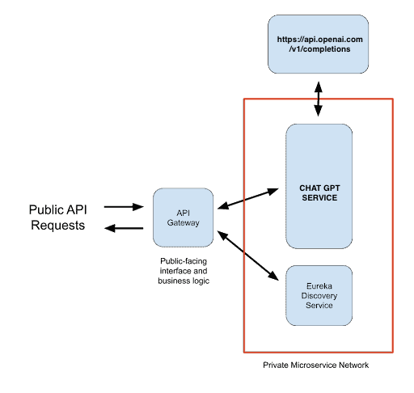

# HomeWork_IZICAP

HomeWork_IZICAP is a microservice project built using Springboot3 and Java 17. The purpose of this project is to communicate with ChatGPT AI via a call to an endpoint that we will expose. For the purpose of this test, we need to build a microservice which updates a “database” in our system with questions we send to ChatGPT and answers that the API gives us.

# Technologies and Programming Languages Used

    Springboot3
    Java 17
    Microservices
    Docker
    Swagger/OpenAPI
    Maven
    Actuator
    Unit tests

# Project Architecture

The architecture of the HomeWork_IZICAP project is based on microservices. It includes the following components:

    * Discovery Services: Responsible for discovering other services registered with the discovery server.
    * ChatGPT Service: Responsible for communicating with the ChatGPT API and updating our "database" with questions and answers.
    * API Gateway: Responsible for routing requests from clients to the appropriate microservice.

# Installation and Usage

Method 1: Using Docker

To install and use the HomeWork_IZICAP project using Docker, follow these steps:

* Install Docker: If you haven't already installed Docker on your machine, download and install it from the official Docker website.
* Pull the image: Open a terminal or command prompt and run the following command to pull the image from Docker Hub:

   
<pre>
docker pull nasreddinera/homeworkizicap:discoveryservices
docker pull nasreddinera/homeworkizicap:chatgpt-service
docker pull nasreddinera/homeworkizicap:api-gateway
</pre>

* Check the downloaded image: Once the image has been downloaded, you can verify that it is present on your machine by running the following command:

<pre>
docker images
</pre>

This command will list all the images that are present on your machine, including the one that you just downloaded.
* Run the container: Finally, you can use the following command to run a container from the downloaded image following this order:
<pre>
    docker run -p 8761:8761 nasreddinera/homeworkizicap:discoveryservices
    docker run -p 8090:8090 nasreddinera/homeworkizicap:chatgpt-service
    docker run -p 8080:8080 nasreddinera/homeworkizicap:api-gateway
</pre>

Method 2: Using Your IDE

To install and use the HomeWork_IZICAP project using your IDE, follow these steps:

* Clone the project repository to your local machine.
* Open the project in your IDE.
    
<pre>
Run DiscoveryservicesApplication.java in com.izicap.discoveryservices.discoveryservices package.
Run ChatgptserviceApplication.java in com.izicap.chatgptservice package.
Run ApiGatewayApplication.java in com.izicap.gateway.apigateway package.
</pre>

# API Documentation

The API documentation for the HomeWork_IZICAP project can be found using Swagger/OpenAPI. Once the project is up and running, you can access the Swagger UI by going to http://localhost:8080/swagger-ui/index.html / http://localhost:8090/swagger-ui/index.htmlin your web browser.
